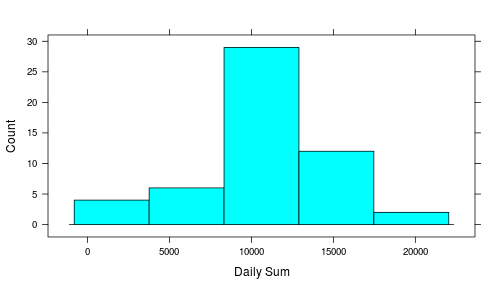
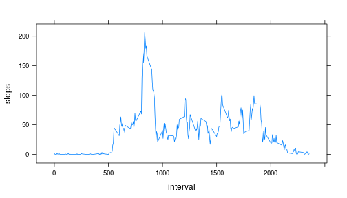
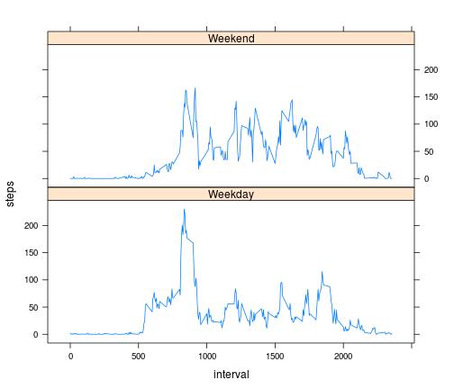

# Reproducible Research: Peer Assessment 1


## Loading and preprocessing the data

```r
library(lattice)
# Read in data from file
activity <- read.csv("./activity.csv")
```


## What is mean total number of steps taken per day?

```r
# Get list of daily sums
dailySum <- tapply(activity$steps, activity$date, sum)

# Create histogram of daily sums
histogram(dailySum, type="count", nint=5, xlab = "Daily Sum")
```

 

```r
# The mean of the daily sums
mean(dailySum, na.rm=TRUE)
```

```
## [1] 10766
```

```r
# The median of the daily sums
median(dailySum, na.rm=TRUE)
```

```
## [1] 10765
```


## What is the average daily activity pattern?

```r
# Get the interval averages
averageInterval <- aggregate(steps ~ interval, data=activity, FUN=mean, na.rm=TRUE)

# Create time series plot of average intervals
with(averageInterval, xyplot(steps ~ interval, type="a"))
```

 

```r
# Interval which has the maximum average number of steps
averageInterval$interval[which.max(averageInterval$steps)]
```

```
## [1] 835
```

## Imputing missing values

```r
# Total number of missing values
missing <- is.na(activity$steps)
sum(missing)
```

```
## [1] 2304
```

Filling in of missing values will be done by using the average across all days
of the corresponding time interval as caluatated in the previous section of
this assignment.


```r
# Copy to a new data.frame
activity2 <- activity

# Replace the missing values with the interval average
missingIntervals <- as.character(activity$interval[missing])
row.names(averageInterval) <- averageInterval$interval
activity2$steps[missing] <- averageInterval[missingIntervals, "steps"]

# Recalculate the daily sums
dailySum2 <- tapply(activity2$steps, activity2$date, sum)

# Create histogram of new daily sums
histogram(dailySum2, type="count", nint=5, xlab = "Daily Sum")
```

 

```r
# The mean of the new daily sums
mean(dailySum2, na.rm=TRUE)
```

```
## [1] 10766
```

```r
# The median of the new daily sums
median(dailySum2, na.rm=TRUE)
```

```
## [1] 10766
```

The replacement of missing values has changed the data in such a way that it is
now more heavily concentrated around the mean.  The mean has not changed, while
the meadian is now equal to the mean.  This is to be expected as the missing
interval data was replaced with it's average value.

## Are there differences in activity patterns between weekdays and weekends?

```r
# Get a factor of the days of the week to use to divide the activity2 data
activity2$day <- factor(ifelse(as.POSIXlt(activity2$date)$wday %% 6 == 0, "Weekend", "Weekday"))
                        
# Get the average intervals by weekday/weekend
dayAverage <- aggregate(steps ~ interval:day, data=activity2, FUN=mean)

# Plot the weekend data
with(dayAverage, xyplot(steps ~ interval | day, type="a", layout=c(1,2)))
```

 
